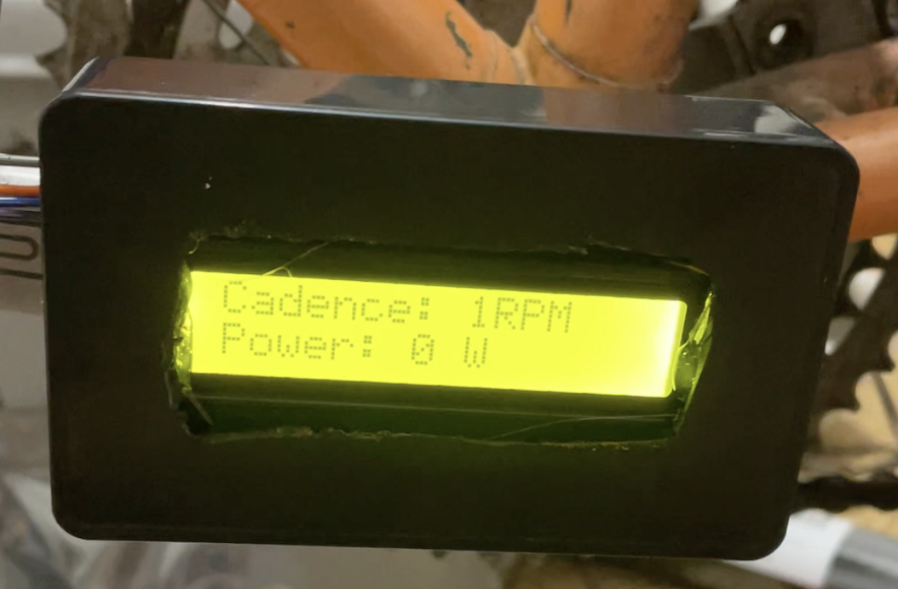

# Arduino Bike Power Meter

Weekend project my brother and I worked on. He worked on hardware. I worked on software.

In theory, it calculates the power output of your pedalling. But it threw out some small numbers. We figured it needed some more calibration.

## Parts:

- Arduino Nano 33 BLE
- 1602 LCD
- HX711 ADC 
- Generic lipstick style power bank

